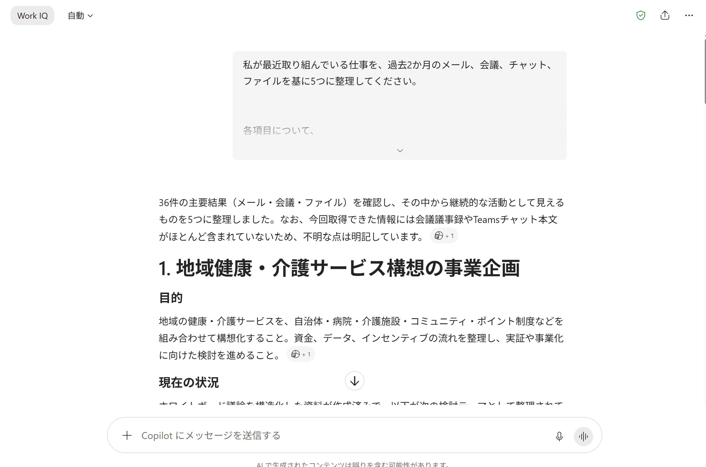

# Copilotはもう、あなたの仕事を知っている｜CHAT-05

| 項目 | 内容 |
|---|---|
| **目的** | 一般知識ではなく、自分の仕事データにグラウンディングされた回答を最初に体験する |
| **所要** | 約 10 分（目安） |
| **利用** | Microsoft 365 Copilot Chat（Work） |
| **入力** | 過去 2 週間の自分のメール、会議、Teams チャット、ファイル |
| **成果** | 進行中の仕事 5 件の整理（目的／現在の状況／関係資料／次に確認すべきこと） |

> **実施条件**：Microsoft 365 Copilot のライセンスがあり、自分のメール・会議・ファイルにアクセスできる場合にハンズオンで実施します。
> そうでない場合は、ファシリテーターのデモを見ながら進めてください。

---

## シナリオ

初日に使うのは、サンプル企業の架空データではありません。**参加者自身がアクセス権を持つメール、会議、チャット、文書**です。

自分の仕事を一言も説明していないのに、Copilot が「あなたが今抱えている 5 件」を並べてくる — この最初の驚きが、30 日間の入口になります。

狙いは、最初から一般知識ではなく、仕事データにグラウンディングされた体験をすることです。

> 進行役の説明例：「今日は機能を覚える日ではありません。Copilot が“あなたの仕事”をどこまで把握しているかを確かめる日です。」

---

## TRY — 手順

1. Copilot Chat を開く
2. **Work** が選択されていることを確認する
3. 直近 2 週間の自分のメール、会議、チャットが Microsoft 365 上にあることを確認する
4. プロンプト ボックスをクリックする
5. 次のプロンプトを貼り付ける

```text
私が最近取り組んでいる仕事を、過去2週間のメール、会議、チャット、
ファイルを基に5つに整理してください。

各項目について、
1. 目的
2. 現在の状況
3. 関係する資料
4. 次に確認すべきこと
を示してください。
不明な点は推測せず「不明」と書いてください。
```

6. **送信**を選ぶ
7. 5 件の整理が、自分の実際の仕事と合っているかを確認する
8. 「不明」と書かれた項目を確認する
9. 引用元やソース参照を、表示されていれば開いてみる
10. 違っている点があれば、フォローアップで補足して再依頼する

**出力例**



> **体験ポイント**：「自分の仕事を説明しなくても、ある程度分かっている」を感じてもらう。

> **補足**：Copilot Chat の Work モードは、ユーザーがアクセスできるファイル、メール、Teams 会議などの Microsoft 365 データを利用できます。

---

<!--
## WATCH

`../assets/DAY-01/` に動画 / GIF を配置してください（実際の画面操作と出力を並置するのがおすすめ）。

---
-->

## REFLECT — 振り返り

- 説明していないのに合っていた項目はどれか
- 「不明」と返ってきた項目は、なぜ Copilot から見えなかったのか
- 精度を上げるために、どの情報を OneDrive / SharePoint / Teams 側に置いておくべきか

---

<!--
## NEXT

- [忙しい朝を3分で整理する｜CHAT-07](./CHAT-07_忙しい朝を3分で整理する.md)

---
-->

## CONTINUE YOUR JOURNEY

この体験を楽しめた方は、こちらもおすすめです。
- [自分のワークペルソナを1枚のスケッチにする｜CHAT-IMG-01](./CHAT-IMG-01_自分のワークペルソナを1枚のスケッチにする.md)
- [プロジェクトの状況を横断的に把握する｜CHAT-14](./CHAT-14_プロジェクトの状況を横断的に把握する.md)
