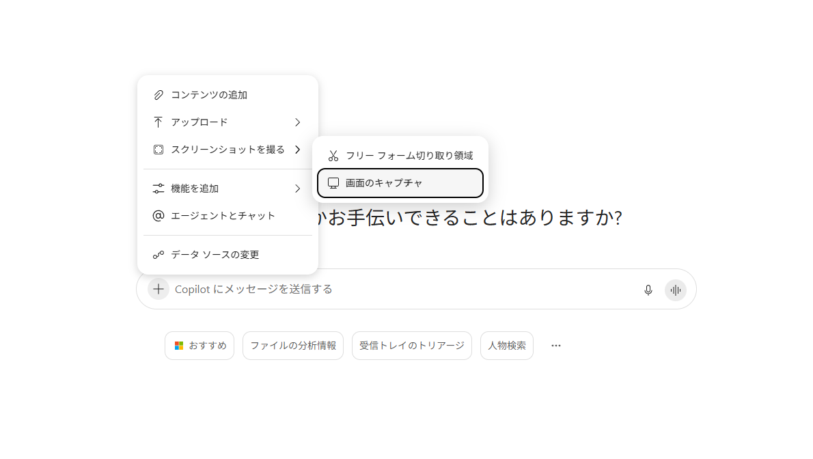
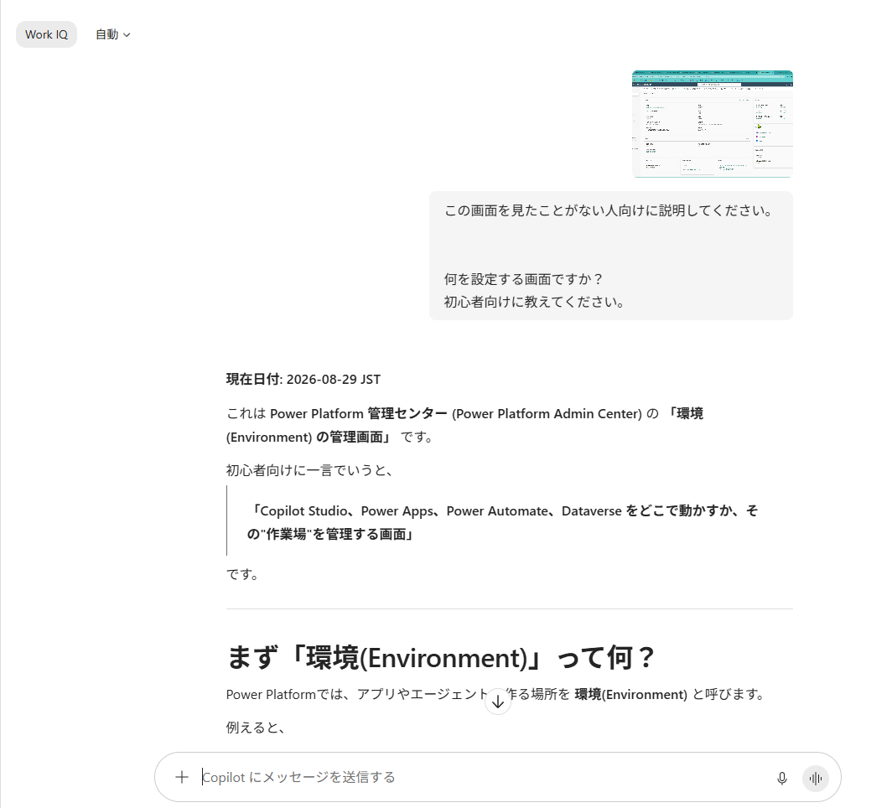

# この画面は何するところ？を、撮って聞く｜CHAT-11

| 項目 | 内容 |
|---|---|
| **目的** | 初めて開いた管理画面を、その場でスクリーンショットから解説してもらう |
| **所要** | 約 10 分（目安） |
| **利用** | Microsoft 365 Copilot Chat（スクリーンショット入力） |
| **入力** | Copilot Studio、Azure ポータル、GitHub、Power Platform 管理センターなど、見慣れない画面 |
| **成果** | その画面の役割・設定項目の意味・次に何をすればよいかの初心者向け解説 |

> **実施条件**：Copilot の画面添付（スクリーンショット）が利用できる環境で実施します。
> 利用できない場合は、画面を保存した画像ファイルを添付しても同じことができます。

---

## シナリオ

初めての管理画面を開いたときの、あの独特の手詰まり感 — 「**そもそも、私はいま何を見ているのか**」。

用語で検索しようにも、その用語自体が読めません。マニュアルを探しても、自分が今いる画面がどこなのか分からない。詳しい人に聞こうにも、質問を組み立てられない。
結局、触らずにタブを閉じる。これが、新しいサービスの学習が止まる典型的な瞬間です。

Copilot なら、**その画面を撮って「これは何？」と聞くだけ**で始められます。用語を知らなくても、質問を組み立てられなくても構いません。目の前の画面が、そのまま質問になります。

この体験は、研修としても効きます。Copilot Studio、Azure ポータル、GitHub、Power Platform — どれも管理者以外には馴染みのない画面ですが、**撮って聞けば、その場で自分のペースで学べる**ことが伝わります。

> 進行役の説明例：「用語が分からないと検索もできません。分からない画面は、まず撮って聞いてしまうのがいちばん早いです。」

---

## TRY — 手順

1. 見慣れない画面を 1 つ開く（例：Copilot Studio、Azure ポータル、GitHub、Power Platform 管理センター）
2. Windows の Copilot アプリを開く
3. 入力欄から**スクリーンショットを撮る**（Web の Copilot Chat の場合は画面を保存した画像を添付する）
4. 設定項目やメニューが画面に収まっていることを確認する
5. 次のプロンプトを貼り付けて送信する

> **プロンプト**

```text
この画面を見たことがない人向けに説明してください。

何を設定する画面ですか？
初心者向けに教えてください。
```

6. 説明を読み、画面の項目と照らし合わせる
7. 分からない用語が残っていたら、そのままフォローアップで聞く
8. 次の質問を続けて、理解を深める

<table>
<tr>
<td width="50%">
 
</td>
<td width="50%">
 
</td>
</tr>
</table>

---

> **フォローアップ例**

```text
この画面で、初心者がまず触るべき項目はどれですか。
逆に、よく分からないうちは触らないほうがよい項目はどれですか。
理由も教えてください。
```

9. 画面上の実際のボタン名と、説明が一致しているかを確認する
10. 別のサービスの画面でも同じことを試し、説明の分かりやすさを比べる

> **応用**：エラー画面を撮って「このエラーは何を意味しますか」と聞く、設定画面を撮って「この設定を有効にすると何が変わりますか」と聞く、といった使い方にも広がります。

> **注意**：説明が実際の画面と食い違う場合があります。**設定を変更する前には、必ず公式ドキュメントで裏を取ってください。**学習の入口として使い、操作の根拠にはしないのが安全な使い方です。

> **注意**：管理画面にはテナント名、ユーザー名、リソース名、キーなどが表示されていることがあります。機密情報が写り込んでいないかを、送信前に必ず確認してください。

---

### 発展（任意）

デモ動画やセッション録画を見ていて、**画面に映っているプロンプトを一時停止して手で書き写した**経験はないでしょうか。
止めて、読んで、打ち直して、また巻き戻す。学びたいのはプロンプトの中身なのに、時間のほとんどが書き写しに消えます。

Copilot は、その画面をそのまま受け取れます。**入力欄からスクリーンショットを撮って、そのまま質問できる**のです。
コピーできないテキスト、動画の中の文字、他アプリの画面 — 選択できないものでも、映っていれば読み取れます。

この体験の価値は、書き写しが省けることではありません。**そのプロンプトがなぜそう書かれているかを分析させ、自分のエージェントの設計に持ち込めること**です。
プロンプト 1 本を、そのまま Agent Builder や Copilot Studio のインストラクション案に変換するところまで進みます。

**Youtubeなどのデモ動画内のプロンプトを読み取る**

1. プロンプトが映っている画面を開く（デモ動画は該当シーンで一時停止する）
2. Copilot Chat を開く
3. 入力欄から**スクリーンショットを撮る**（または画面を保存した画像を添付する）
4. プロンプトの部分が画面に収まっていることを確認する
5. 次のプロンプトを貼り付けて送信する

> **プロンプト（抽出）**

```text
画面内のプロンプトをすべて抽出してください。

Markdown形式にしてください。
英語部分は日本語訳も併記してください。
省略されている可能性がある箇所は推測せず、
不明と記載してください。
```

---

<!--
## WATCH

`../assets/SHOT-02/` に動画 / GIF を配置してください（見慣れない管理画面 → スクショ → 初心者向け解説、の 3 コマ構成がおすすめ）。

---
-->

## REFLECT — 振り返り

- 説明を読む前と後で、その画面への抵抗感はどう変わったか
- 説明の中で、実際の画面と食い違っていた箇所はあったか
- 自分で検索した場合と比べて、どちらが早かったか
- 新しいサービスを学ぶとき、この使い方をどこに組み込めるか
- 後輩や他部門の人に勧めるとしたら、どの画面から試してもらうか

---

## CONTINUE YOUR JOURNEY

この体験を楽しめた方は、こちらもおすすめです。
- [ホワイトボード写真から議事録とスライドを作る｜AGB-03](../07-agent-builder/AGB-03_ホワイトボード写真から議事録とスライドを作る.md)
