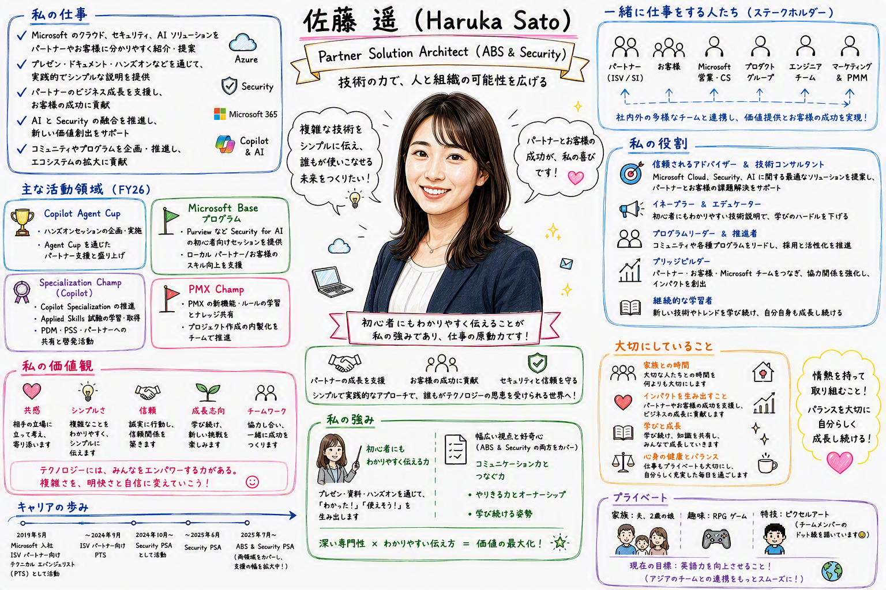
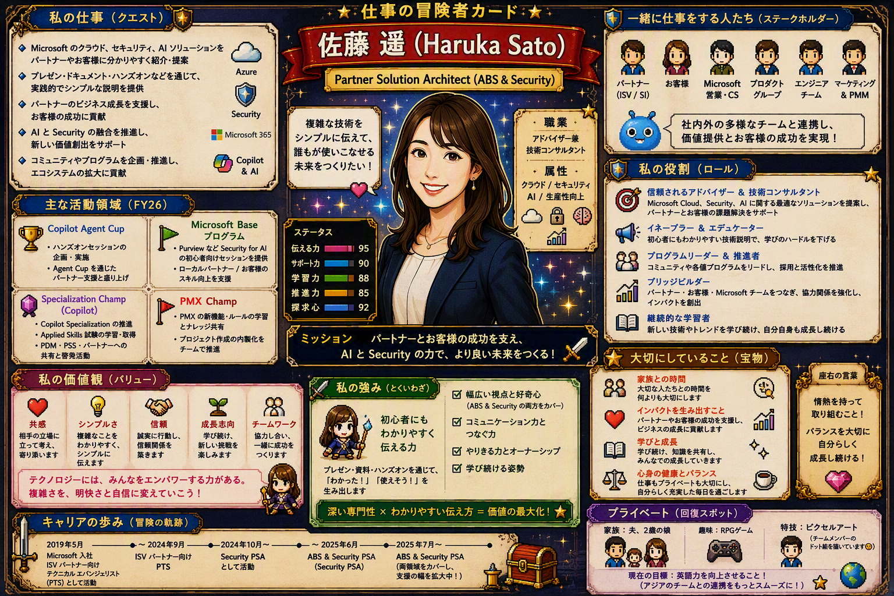

# 自分のワークペルソナを1枚のスケッチにする｜CHAT-IMG-01

| 項目 | 内容 |
|---|---|
| **目的** | Copilot が把握している自分の仕事、関係者、役割、価値観を、ホワイトボード風の1枚絵として可視化する |
| **所要** | 約 10 分（目安） |
| **利用** | Microsoft 365 Copilot Chat |
| **入力** | Work IQ の業務コンテキスト ＋ LinkedIn 公開プロフィール ＋ 顔写真（任意） |
| **成果** | 自分の仕事内容、ステークホルダー、役割、価値観、大切にしていることを表したホワイトボード風スケッチ |

---

## シナリオ

日々のメール、会議、チャット、ドキュメント、予定表には、自分が何に時間を使い、誰と働き、どのような役割を担っているかが表れています。
この演習では、Microsoft 365 Copilot Chat に、自分の業務コンテキストをもとにした**ワークペルソナのスケッチ**を作成させます。必要に応じて顔写真を添付し、中央のキャラクターに見た目の特徴を反映します。
単なる画像生成ではなく、Copilot が自分の働き方をどのように捉えているかを、**仕事 → 関係者 → 役割 → 価値観 → 大切なこと**の観点で振り返る体験です。

> 進行役の説明例：「これはCopilot が業務コンテキストからあなたの仕事をどう理解しているかを可視化する演習です。」
> 「画像の完成度だけでなく、何が強調されているか、事実に即しているかどうかにも注目してください。」

---

## TRY — 手順

1. Microsoft 365 Copilot Chat で新しいチャットを開始する
2. 任意で、自分の顔写真をアップロードする
3. 顔写真を使用する場合は、正面から撮影された、顔が確認しやすい写真を選ぶ
4. プロンプト ボックスをクリックする
5. 次の指示を貼り付ける

```text
自分の仕事や働き方を可視化した画像を作成してください。

スタイルは、フォトリアルでありながらクリーンな
「ホワイトボードの手描きスケッチ風（cartoon whiteboard sketch style）」
でお願いします。

画像には以下の要素を含めてください。
・自分が何をしているか（仕事内容）
・誰と仕事をしているか（ステークホルダー）
・自分の役割（Role）
・自分の価値観（Values）
・自分にとって大切なこと（What matters）

添付した顔写真をもとに、中央に自分のキャラクター（スケッチ）を配置してください。
見た目の再現のガイドとして顔写真を活用してください。
顔写真を添付していない場合は、特定の外見を推測せず、汎用的な人物キャラクターにしてください。

また、内容は Work IQ の情報と、自分の LinkedIn 公開プロフィールを参考にしながら構成してください。
全体として、情報量が豊富で内容がしっかり詰まった
（rich in information）グラフィックにしてください。

なお、一緒に働いている人たちについては勝手に推測せず、
汎用的なアイコンを利用するか、取得可能な公開情報のみ使用してください。
```

6. **送信**を選ぶ
7. 生成されたスケッチ全体を確認する
8. 自分の役割がどのように表現されたかを確認する
9. 目立っているステークホルダーや仕事内容を確認する
10. 表現された価値観や「大切なこと」が自分の認識と合っているか確認する
11. 必要に応じて、修正したい点を追加プロンプトで伝える

**出力例**



### 発展（任意）

生成結果を見たあと、気になるテーマを 1 つ選んで追加指示を試します。

**Version A：3 年後の自分へアップデートする**

```text
このスケッチを「3年後に目指す自分」の姿へアップデートして、再度画像出力してください。
現在から変わるポイントがひと目で分かるように表現してください。
```

**Version B：自分の「仕事の取扱説明書」にする**

```text
このスケッチを、初めて一緒に働く人に見せる
「私の仕事の取扱説明書」に作り変えて再度画像を出力してください。
```

**Version C：RPG のキャラクターカードにする**

```text
このスケッチを、仕事をテーマにしたRPGのキャラクターカード風に
楽しくアレンジして再度画像を出力してください。
```

**出力例**



---

<!--
## WATCH

`../assets/CHAT-IMG-01/` に動画 / GIF / 生成例画像を配置してください。

---
-->

## REFLECT — 振り返り

- プロンプトで指定した仕事内容、関係者、役割、価値観が画像に反映されているか
- 生成された内容を実際の業務情報と照合し、正確な点と誤っている点を区別できるか
- 入力していない情報の推測、過度な一般化、重要な情報の欠落が含まれていないか
- 画像内の見出しやラベルは、意図した意味で正しく、読みやすく表現されているか
- 追加プロンプトで修正を指示したとき、変更内容が正確に反映されたか
- より正確で目的に合う出力を得るには、どのような背景情報や具体的な指示を追加するとよいか
- Copilot の出力は完成した事実ではなく、利用者が確認して修正する必要がある下書きだと理解できたか

**利用できない場合の進め方**
事前に用意した生成例画像と、その生成に使ったプロンプトを見せ、「指示が正しく反映されているか」「事実確認が必要な箇所はどこか」「どのような追加指示で改善できるか」を参加者に問いかけます。

---

## NEXT

- 生成画像を保存し、他のユーザーと共有する
- 追加プロンプトで画像をアレンジし、指示による出力の変化を比較する

## CONTINUE YOUR JOURNEY

この体験を楽しめた方は、こちらもおすすめです。
- [自社のホームページから企業紹介インフォグラフィックを作る｜CHAT_IMG-02](./自社のホームページから企業紹介インフォグラフィックを作る_CHAT-IMG-02.md)
