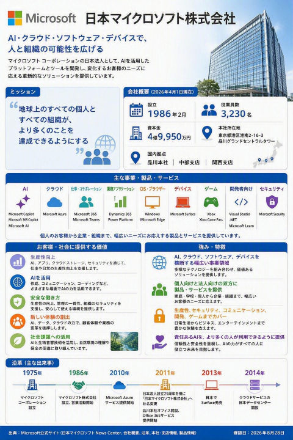
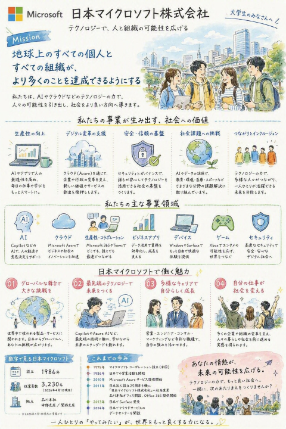

# 自社のホームページから企業紹介インフォグラフィックを作る｜CHAT-IMG-02

| 項目 | 内容 |
|---|---|
| **目的** | 自社ホームページの公開情報をもとに、会社の特徴や事業内容を1枚で伝える企業紹介インフォグラフィックを作成する |
| **所要** | 約 10 分（目安） |
| **利用** | Microsoft 365 Copilot Chat |
| **入力** | 自社ホームページの URL |
| **成果** | 会社概要、事業内容、強み、提供価値、企業姿勢をまとめた企業紹介インフォグラフィック |

---

## シナリオ

自社について初めて知る顧客、パートナー、採用候補者に、会社の全体像を短時間で伝えるには、情報を分かりやすく整理したビジュアルが効果的です。
この演習では、Microsoft 365 Copilot Chat に**自社ホームページの URL**を渡し、公開されている情報をもとに企業紹介インフォグラフィックを作成させます。
単なる画像生成ではなく、Copilot が自社をどのように捉えたかを、**会社概要 → 事業内容 → 強み → 提供価値 → 企業姿勢**の観点で確認する体験です。
進行役の説明例：「ホームページの URL だけを手がかりに、Copilot が自社の特徴をどこまで整理し、1枚のビジュアルにできるかを試します。」
「画像の見栄えだけでなく、情報が正確か、重要な特徴が伝わるかにも注目してください。」

---

## TRY — 手順

1. Microsoft 365 Copilot Chat で新しいチャットを開始する
2. 自社ホームページの URL をコピーする
3. プロンプト ボックスをクリックする
4. 次の指示内の `[自社ホームページのURL]` を実際の URL に置き換えて貼り付ける

```text
次の自社ホームページを確認し、企業紹介のインフォグラフィックを作成してください。

自社ホームページ：
[自社ホームページのURL]

ホームページ内の公開情報をもとに、以下の要素を整理してください。
・会社名と短い紹介文
・主な事業、製品、サービス
・顧客や社会に提供している価値
・自社の強みや特徴
・企業理念、ミッション、ビジョン、価値観
・沿革、実績、拠点、従業員数など、企業理解に役立つ主な情報

すべての項目を無理に埋めず、ホームページで確認できる情報だけを使用してください。
確認できない内容や数値は推測せず、省略してください。

デザインは、初めてこの会社を知る人にも全体像が伝わる、
クリーンで親しみやすい企業紹介インフォグラフィックにしてください。
会社のブランドカラーやロゴをホームページで確認できる場合は、
それらを参考にしつつ、読みやすさを優先してください。

見出し、短い説明文、アイコン、図解を組み合わせ、
情報量がありながらも重要なポイントをひと目で把握できる1枚にしてください。
画像内の文章は日本語で、簡潔かつ自然にしてください。

画像を生成する前に、使用する情報と参照元のページを箇条書きで示してください。
私が内容を確認したあとに、インフォグラフィックを生成してください。
```

5. **送信**を選ぶ
6. Copilot が提示した情報と参照元を確認する
7. 誤りや古い情報があれば、修正内容を伝える
8. 内容に問題がなければ、次の指示を送る

```text
確認しました。この内容で企業紹介インフォグラフィックを生成してください。
```

9. 生成されたインフォグラフィック全体を確認する
10. 会社の特徴や提供価値が正しく伝わるかを確認する
11. 必要に応じて、修正したい点を追加プロンプトで伝える

**出力例**



### 発展（任意）

生成結果を見たあと、次のいずれかの追加指示を試します。

**Version A：顧客向けにする**

```text
見込み顧客向けに、製品・サービスと導入価値がより伝わる構成にしてください。
```

**Version B：採用候補者向けにする**

```text
大学生の採用候補者向けに、ミッション、事業の社会的意義、働く魅力が伝わる構成にしてください。手書き風の柔らかい印象を意識してください。
```

**Version C：SNS投稿向けにする**

```text
SNSで共有しやすい縦長の構成にし、情報を重要な5項目に絞ってください。
```

**Version B 出力例**


---

<!--
## WATCH

`../assets/CHAT-IMG-02/` に動画 / GIF / 生成例画像を配置してください。

---
-->

## REFLECT — 振り返り

- Copilot は自社をどのような会社として表現したか
- 自社が伝えたい印象と、生成された表現は一致しているか
- どの事業、製品、サービスが目立っているか
- 顧客や社会への提供価値が明確に伝わるか
- 自社の強みや他社との違いが適切に表現されているか
- ホームページの情報だけでは伝わりにくかった点は何か
- 誤り、古い情報、過度な一般化、推測が含まれていないか
- 対象者に応じて、どの情報を追加または削除すべきか
- 公開・共有する前に、ブランドガイドライン、ロゴの利用条件、掲載情報の正確性を担当者が確認する

**利用できない場合の進め方**
事前に用意した企業ホームページと生成例画像を見せ、「ホームページのどの情報が画像に反映されているか」「企業紹介として何を追加・修正すべきか」を参加者に問いかけます。

---

## NEXT

- 生成画像を保存し、Copilot Experience Lab の体験記録として残す
- 広報、営業、採用などの担当者と内容を確認し、用途別のバリエーションを作る

## CONTINUE YOUR JOURNEY

この体験を楽しめた方は、こちらもおすすめです。
- [自分のワークペルソナスケッチを作成｜CHAT_IMG-01](./自分のワークペルソナを1枚のスケッチにする_CHAT-IMG-01.md)
