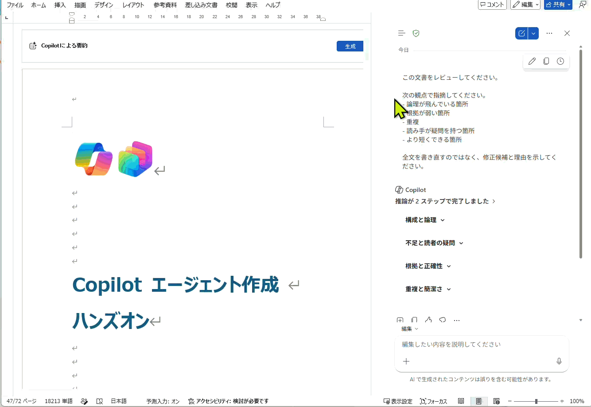

# 長い文書をレビューしてもらう｜WRD-02

| 項目 | 内容 |
|---|---|
| **目的** | 書き直しではなく、修正候補と理由を受け取って自分で直す |
| **所要** | 約 10 分（目安） |
| **利用** | Microsoft 365 Copilot Chat（Work） ／ Word の Copilot |
| **入力** | 自分が書いた、長めの文書（提案書、報告書、設計メモなど） |
| **成果** | 5 観点の指摘（論理の飛び／根拠が弱い／重複／疑問点／短縮候補）と修正候補 |

> **実施条件**：Microsoft 365 Copilot のライセンスがあり、自分のメール・会議・ファイルにアクセスできる場合にハンズオンで実施します。
> そうでない場合は、ファシリテーターのデモを見ながら進めてください。

---

## シナリオ

レビューを人に頼むには時間がかかり、頼まれた側も全文を読む必要があります。

今日は、提出前の自己レビューを Copilot に任せます。ただし **全文を書き直させない** ことが条件です。直すのは自分です。

> 進行役の説明例：「書き直された文章ではなく、指摘の理由を読んでください。」

---

## TRY — 手順

1. 提出前の自分の文書を 1 点選ぶ
2. ファイルが OneDrive または SharePoint 上にあることを確認する
3. Wordでファイルを開くか、Copilot Chat を開き、対象文書を指定する
4. プロンプト ボックスをクリックする
5. 次のプロンプトを貼り付ける

```text
この文書をレビューしてください。

次の観点で指摘してください。
- 論理が飛んでいる箇所
- 根拠が弱い箇所
- 重複
- 読み手が疑問を持つ箇所
- より短くできる箇所

全文を書き直すのではなく、修正候補と理由を示してください。
```

6. **送信**を選ぶ
7. 指摘が「箇所 ＋ 理由」の形になっているかを確認する
8. 自分でも気づいていた指摘と、気づいていなかった指摘を分ける
9. 納得できる指摘だけを採用して修正する
10. 修正後、もう一度同じプロンプトでレビューする

---

### 実行例
Word内でCopilotを開き、今回のプロンプトを打った後の動作です


---

<!--
## WATCH

`../assets/DAY-16/` に動画 / GIF を配置してください（実際の画面操作と出力を並置するのがおすすめ）。

---
-->

## REFLECT — 振り返り

- 自分では気づけなかった指摘はどれか
- 採用しなかった指摘は、なぜ採用しなかったのか
- この自己レビューを、どの文書で必ず行うと決めるか

---

## CONTINUE YOUR JOURNEY

この体験を楽しめた方は、こちらもおすすめです。

- [短いブリーフを10章のローンチ文書に展開する｜WRD-01](./WRD-01_短いブリーフを10章のローンチ文書に展開する.md)
- [既存資料を要約する｜CHAT-17](../01-copilot-chat/CHAT-17_既存資料を要約する.md)
