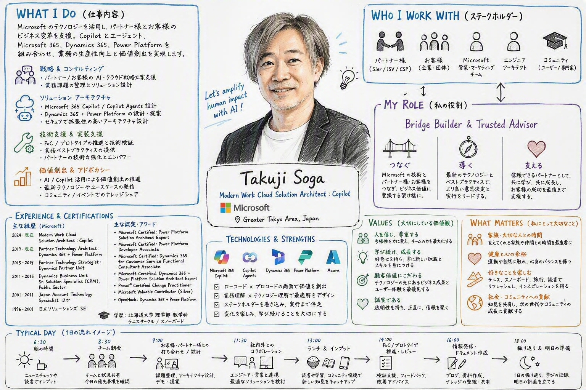

# Experience 01 - Create Your Work Persona Sketch


## 🎯 What You'll Experience

Microsoft 365 Copilot を使って、

**「私のワークライフを1枚のイラストにする」**

体験です。

Copilot は単なるチャット AI ではありません。

あなたのメール、会議、予定表、コラボレーション履歴などを理解しながら、
あなたの働き方や役割を把握しています。

この体験では、その理解をもとに
1枚のホワイトボード風スケッチを作成します。

結果として、

- 自分は何に時間を使っているのか
- 誰と働いているのか
- 何を重視しているのか
- どんな役割を担っているのか

を視覚的に振り返ることができます。

---

## 💡 Why This Is Interesting

この体験は海外で話題になっています。

面白いのは、

単なる画像生成ではなく、

**Work IQ**

を活用していることです。

Microsoft 365 Copilot は、

- メール
- 会議
- チャット
- ドキュメント
- 予定表

などを横断して理解しています。

そのため、一般的な画像生成 AI とは異なり、

**「あなたらしい働き方」**

を表現した画像を作成できます。

---

## ✅ Prerequisites

- Microsoft 365 Copilot ライセンス
- Microsoft 365 Copilot Chat
- 顔写真（推奨）

> 顔写真は必須ではありませんが、添付することでより自分らしいキャラクターになります。

---

## 🚀 Step 1 - Microsoft 365 Copilot を開く

Microsoft 365 Copilot Chat を開きます。

---

## 🚀 Step 2 - 顔写真をアップロード

任意で顔写真を添付します。

正面から撮影された写真を推奨します。

---

## 🚀 Step 3 - プロンプトを入力

以下のプロンプトをそのまま利用してください。

```text
自分の仕事や働き方を可視化した画像を作成してください。

スタイルは、フォトリアルでありながらクリーンな
「ホワイトボードの手描きスケッチ風
(cartoon whiteboard sketch style)」
でお願いします。

画像には以下の要素を含めてください。

・自分が何をしているか（仕事内容）
・誰と仕事をしているか（ステークホルダー）
・自分の役割（Role）
・自分の価値観（Values）
・自分にとって大切なこと（What matters）

添付した顔写真をもとに、
中央に自分のキャラクター（スケッチ）を配置してください。

見た目の再現のガイドとして顔写真を活用してください。

また、内容はWork IQの情報と、
自分のLinkedIn公開プロフィールを参考にしながら構成してください。

全体として、情報量が豊富で内容がしっかり詰まった
（rich in information）グラフィックにしてください。

なお、一緒に働いている人たちについては勝手に推測せず、
汎用的なアイコンを利用するか、
取得可能な公開情報のみ使用してください。
```

---

## 🔍 What To Look For

生成された画像を確認してみてください。

以下の観点で見ると面白い発見があります。

### 1. 自分の役割はどう表現されたか

自分が思っている役割と一致していますか？

---

### 2. 誰との仕事が目立つか

重要なステークホルダーが反映されていますか？

---

### 3. 何に時間を使っているように見えるか

実際とイメージは一致していますか？

---

### 4. 大切にしている価値観は何か

Copilot はあなたの働き方から何を読み取ったでしょうか？

---

## 🧠 Reflection

以下の質問を考えてみましょう。

- この画像は自分らしいですか？
- 足りない要素はありますか？
- 今後もっと強化したい役割はありますか？
- 自分の時間の使い方を変えるなら何を変えますか？

---

## 🌟 Bonus Challenge

プロンプトを変更して試してください。

### Version A

```text
より未来志向で描いてください。
今後3年間で目指したい姿も含めてください。
```

### Version B

```text
マネージャー視点で私を表現してください。
```

### Version C

```text
チームメンバー視点で私を表現してください。
```

---

## ✨ What You Learned

例：
<p align="center">

</p>

この体験を通じて、

- CopilotがWork IQを活用できること
- Copilotが業務コンテキストを理解していること
- 自分の働き方を新しい視点で振り返れること

を体感できました。

これは単なる画像生成ではなく、

**「Copilotがあなたをどこまで理解しているか」**

を体験するラボです。
